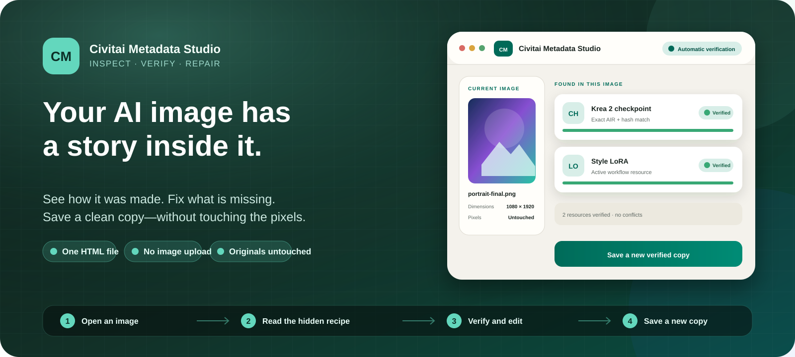

<div align="center">
  
</div>

<h1 align="center">Civitai Metadata Studio</h1>

<p align="center">
  <strong>Open an AI image. See how it was made. Fix the record. Save a clean copy.</strong>
</p>

<p align="center">
  A private, portable metadata editor that runs as one HTML file in your browser.<br>
  No installation. No account. No image uploads. Your original is never changed.
</p>

<p align="center">
  <a href="https://github.com/chriscollins500/civitai-metadata-studio/raw/refs/heads/main/dist/civitai-metadata-studio.zip"></a>
  <a href="dist/civitai-metadata-studio.html"></a>
</p>

<p align="center">
  <a href="https://github.com/chriscollins500/civitai-metadata-studio/actions/workflows/ci.yml"></a>
  
  
  <a href="LICENSE"></a>
</p>

---

## What is this?

AI-generated images can carry a hidden recipe: the prompt, model, LoRAs, seed, sampler, image size, and sometimes the entire workflow that created them.

That recipe is useful—but it is often incomplete, duplicated, or simply wrong. A disabled LoRA may appear as active. The negative prompt may accidentally repeat the positive prompt. A model name may be present without a reliable link back to Civitai.

**Civitai Metadata Studio reads that hidden information, organizes it into one clear record, verifies exact model identities when possible, lets you edit the result, and saves a new corrected image.** The visible image is not re-encoded or altered.

> New to Civitai, ComfyUI, or LoRAs? That is completely fine. You do not need to understand the technical terms to use the tool. Open an image, review what was found, and save a better copy.

<details>
<summary><strong>A ten-second guide to the jargon</strong></summary>

- **Metadata** is hidden information stored inside a file—like notes attached to the image.
- **Civitai** is a website and catalog where people share AI image models and creations.
- **ComfyUI** is a visual, node-based program for creating AI images. It can store its complete workflow inside the finished image.
- A **LoRA** is a smaller add-on that teaches or steers a larger image model toward a style, character, subject, or behavior.
</details>

## Use it in 30 seconds

1. **[Download the app](https://github.com/chriscollins500/civitai-metadata-studio/raw/refs/heads/main/dist/civitai-metadata-studio.zip).** It is a tiny ZIP containing one HTML file.
2. **Unzip it, then double-click the HTML file.** It opens in your current web browser like a small desktop app.
3. **Drop in one image or a whole batch.** PNG, JPEG, and WebP are supported.
4. **Review, edit, and save.** Every result is a new copy; your originals stay exactly where they are.

There is no installer and nothing to configure. Keep the HTML file anywhere you like—even on a USB drive. If you prefer the loose file, open the [standalone HTML](dist/civitai-metadata-studio.html) and use GitHub's **Download raw file** button.

## Why would I use it?

| If you want to… | Civitai Metadata Studio helps you… |
| --- | --- |
| Post an image to Civitai | Repair missing generation details and connect resources to their exact Civitai pages. |
| Recreate an older image | Recover the prompt, seed, sampler, model, LoRAs, VAE, dimensions, and workflow when they are present. |
| Clean up an image library | Inspect or repair many images in one batch and download the results together. |
| Check a complex ComfyUI workflow | Follow the path that actually produced the image and ignore disabled, bypassed, or unused branches. |
| Share work responsibly | Preserve useful creation details while removing sensitive camera, location, and device metadata by default. |
| Understand a downloaded AI image | See what its metadata claims, what Civitai can verify, and where the evidence disagrees. |

## It fixes the problems that are easy to miss

| Common metadata problem | What the Studio does |
| --- | --- |
| The saved width and height are wrong | Starts with the image's real pixel dimensions—the objective truth—while still letting you edit the fields. |
| Positive text appears in the negative prompt | Reads prompt meaning from the active workflow instead of copying text from an empty or disabled branch. |
| A turned-off LoRA is listed as used | Traces only nodes that lead to the real output and excludes muted, bypassed, disabled, and zero-strength resources. |
| The same checkpoint or LoRA appears twice | Combines entries only when exact evidence proves they are the same resource. |
| A resource has a name but no reliable identity | Checks AIR values, numeric version IDs, and exact hashes against Civitai. It never invents an ID from a filename. |
| Two metadata sources disagree | Shows the conflict for review instead of silently choosing one. |
| Saving metadata damages the image | Copies the original encoded pixel and animation data unchanged into a new file. |

## What can you work with?

### The generation recipe

- Positive and negative prompts
- Seed, steps, CFG, guidance, sampler, scheduler, denoising, and clip skip
- Width and height, initialized from the image's real pixels
- Primary model, VAE, hashes, and software information

### The resources used

- Checkpoints and diffusion models
- LoRAs, embeddings, and VAEs
- Text encoders and CLIP models
- ControlNet, IPAdapter, and upscaler resources
- Civitai AIR identifiers, model/version IDs, file IDs, hashes, creator details, trained words, and license notes

When a resource is verified, its name becomes a link to the exact model version on Civitai.

### The rest of the file

Other supported metadata is displayed clearly and can be selectively preserved:

- A1111-style generation parameters
- Civitai image metadata
- Original ComfyUI prompt and workflow data
- EXIF, XMP, IPTC, color-profile, orientation, and other supported metadata
- Privacy-sensitive GPS, camera serial, lens serial, and MakerNote data, which is removed by default

## Private by design

Your images, prompts, workflows, model files, and local paths stay in your browser.

Automatic Civitai verification sends only exact hashes or numeric version IDs. A resource name is sent only when **you** press the search button, and a public image ID is sent only when **you** choose to import that image's public metadata.

The tool has:

- no server component;
- no account or sign-in;
- no API-key field;
- no analytics or tracking;
- no external scripts;
- no image-upload feature.

Exact public identity results are cached locally to make repeat lookups faster. The cache is bounded, disposable, never stores prompts or image data, and can be cleared at any time. Read the full [security and privacy notes](SECURITY.md) for the precise boundary.

## Your pixels stay your pixels

Civitai Metadata Studio is a metadata editor, not an image editor.

When you save, it creates a new file in the same format and copies the original encoded image or animation payload into it. PNG image data, JPEG scan data, and WebP image/animation data are preserved rather than passed through a canvas or image encoder.

That means:

- no generational quality loss;
- no accidental resize;
- no color shift from re-encoding;
- no change to the original file;
- support for 8K images and larger, within the limits of your browser and computer.

Even if a very large image cannot be previewed, its metadata can still be inspected and repaired.

## Civitai verification without the guesswork

The Studio prefers exact evidence in this order:

**AIR / version ID → SHA-256 → BLAKE3 → AutoV3 → AutoV2 → CRC32 → AutoV1**

Automatic requests are batched, cached, and rate-limit aware so a folder of images does not create one request per field. If Civitai asks the app to slow down, it stops and opens one shared cooldown instead of retrying repeatedly.

Names and filenames are useful clues, but they are not proof. The Studio will show them as unresolved candidates until you provide exact evidence or explicitly choose a Civitai search result.

## Works with more than ComfyUI

You do **not** need to use ComfyUI.

The Studio understands common metadata from:

- ComfyUI images and embedded workflows;
- A1111-style `parameters` and EXIF `UserComment` data;
- Civitai structured image metadata;
- PNG, JPEG, and WebP containers;

For ComfyUI images, it follows the active graph upstream from the real output. This is what lets it avoid claiming that disconnected, bypassed, muted, switched-off, or zero-strength resources created the image.

## Frequently asked questions

<details>
<summary><strong>Does it change my original image?</strong></summary>

No. Browser security prevents the app from writing back into the source file. Every save creates a new download with a suffix you control.
</details>

<details>
<summary><strong>Are my images uploaded anywhere?</strong></summary>

No. Image bytes never leave your browser. Only exact identity evidence is used for automatic Civitai lookups.
</details>

<details>
<summary><strong>Do I need a Civitai account or API key?</strong></summary>

No. The tool uses Civitai's public, read-only endpoints and stores no credentials.
</details>

<details>
<summary><strong>Can I use it offline?</strong></summary>

Yes for reading, editing, and saving metadata. Internet access is needed only for Civitai verification, name search, exact resource links, and public image import.
</details>

<details>
<summary><strong>Can it identify a model from its filename?</strong></summary>

It can show the filename as a clue, but it will not pretend that a name is proof. Positive identification requires an AIR/version ID or an exact supported hash.
</details>

<details>
<summary><strong>What happens when metadata sources disagree?</strong></summary>

The Review tab shows the original, chosen, and alternative values. Existing information is not silently replaced.
</details>

<details>
<summary><strong>Which browser should I use?</strong></summary>

Use a current desktop browser. The project intentionally targets current web standards and does not include legacy-browser compatibility code. The release is smoke-tested in current Chrome, and automated verification runs on Windows and Linux.
</details>

## For developers and auditors

The distributed app has no runtime dependencies. Node.js is used only to assemble and test the portable release.

```powershell
npm run check
npm test
npm run verify
```

The test suite covers exact hash vectors, AIR parsing, prompt boundaries, Unicode EXIF, active ComfyUI graph traversal, duplicate identity handling, API batching and caching, rate limits, 8K containers, ZIP output, CSP, accessibility contracts, and byte-identical preservation of PNG, JPEG, and WebP image payloads.

- [Security and privacy model](SECURITY.md)
- [Design and architecture audit](docs/design-audit.md)
- [Contribution requirements](CONTRIBUTING.md)
- [Release history](CHANGELOG.md)

## License

Civitai Metadata Studio is available under the [MIT License](LICENSE).

---

<p align="center">
  <strong>Your image stays yours. Its story becomes useful again.</strong>
</p>
